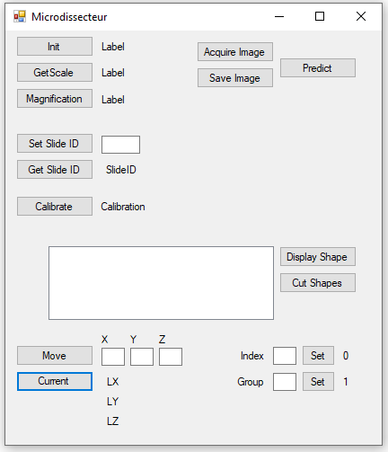
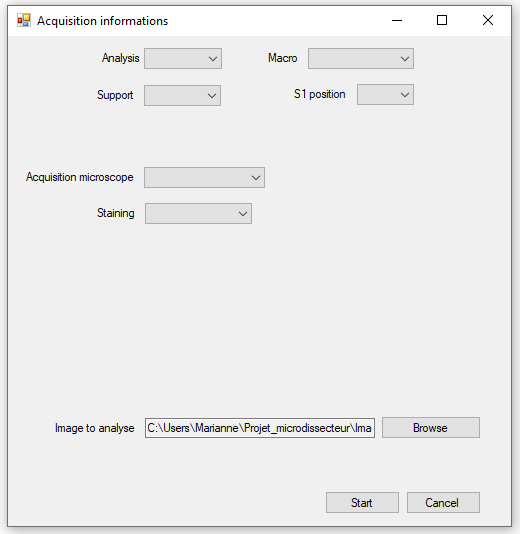
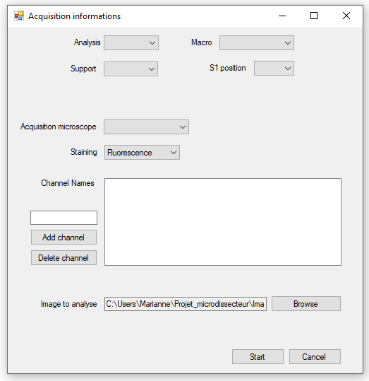

# DOCUMENTATION - CTRemoteClient

## How to use the program

1. Turn on the microdissecteur and run CellTools

2. Run the program ``CTRemoteClient.application`` (located at *C:/User/Admin/Projet_Microdissecteur/Client*) (raccourci sur le bureau ??)

## Options and features

### Form 1

When running the program, a first form opens allowing you to work with the microdissecteur:



- `Init`: only on demo server, checks if server is running

- `GetScale`: returns pixel/mm number

- `Magnification`: returns factor magnification of acquired image

- `Acquire Image`: acquire an image at the current position

- `Save image`: save the image just acquired
  
- `Predict`: predict the regions of interest on the image just saved. This button will open the second form (see next section)

- `Set Slide ID`: set the name of the current slide (ex: *slide1*)

- `Get Slide ID`: get the name of the current slide

- `Display Shape`: displays and send the regions of interest to CellTools. This option in only available after the prediction

- `Cut Shapes`: dissect the regions of interest

- `Move`: move to the indicated X,Y,Z positions (in pixel)

- `Current`: get current position in mm

- `Index`: set the slide index to 0 (top slide) /1 (mid slide) /2 (bottom slide). When the program is openned, it it automatically set to 0

- `Group`: set the shape group. When the program is openned, it is automatically set to 1

### Form 2

When the `Predict` button is clicked, a second form opens:



- `Analysis`: the type of analysis you want to run (for now, just the logiciel name)

- `Macro`: the name of the macro to use. To be displayed in this list, the macro needs to be in the **C:\User\Admin\Projet_microdissecteur\Macro** folder

- `Support`: the type of support you are using
  
- `A1 position`: the position of each slide (the name will be changed if you set a name for your slide)

- `Acquisition microscope`: microscope from which the image was acquired. This options is only displayed if the image was acquired from a different microscope

- `Staining`: the type of staining used

- `Image to analyse`: the path to the image to analyse. This option is only displayed if the image was acquired on a different microscope than the microdissecteur

Another feature only displays if you chose the **fluorescence staining**:



- `Add channel`: add a channel

- `Delete channel`: deletes a channel

To indicate which markers need to be present on the cells of interest, the appropriate channels need to be checked (see CD8 in blue). The unchecked channels won't appear on the phenotype of interest.

This option is important to determine the cells/regions of interest depending on the staining.

## How to use your own scripts or classifiers

The program analyses an image, and save the coordinates of the regions of interest into a specific file (*example_ij.csv*). After coding your script, they need to be added to the microdissecteur projet, at:

```shell
C:\User\Admin\Projet_microdissecteur\Macro
```

The trained classifiers need to be added at:

```shell
C:\User\Admin\Projet_microdissecteur\Macro\Classifiers
```

### QuPath

To obtain this type of file with a Qupath script, you need to add this code at the end of it:

```java
//Create file
def path = buildFilePath(path_to_directory, 'results_ROI.txt');
def file = new File(path);
file.text = "";

//Add ROI to file
for (annotation in getAnnotationObjects()){
        if (annotation.getPathClass() == getPathClass("Positive")){
                def roi = annotation.getROI();
                file << roi.getAllPoints() << System.lineSeparator();
        }else{
                continue;
        }
}
```

A example of the file created with this script is given at *example_qp.txt*.

The ``getPathClass`` function needs be be run on the class of interest (here, the "Positive" class): the name needs to be changed if you named it differently. path_to_directory also needs to be changed to your own path.

### ImageJ

To obtain this type of file with a Qupath script, you need to add this code:

```java
//Function to get results of each ROI selection
function get_coordinates(name){
        nr = nResults;
        Roi.getCoordinates(x, y);
        for (i=0; i<x.length; i++){
                setResult("Coord", i+nr, name);
                setResult("X", i+nr, x[i]);
                setResult("Y", i+nr, y[i]);
        }
}

//Get & save results in .csv file named after the image
n = roiManager("count");
for (i=0; i<n; i++){ //For each ROI, list each coordinates with get_coordinates
        name = i+1;
        roiManager("Select", i);
        get_coordinates(name);
}
fileName = s[0]+"_ROI.csv";
saveAs("Results", fileName);
}
```
